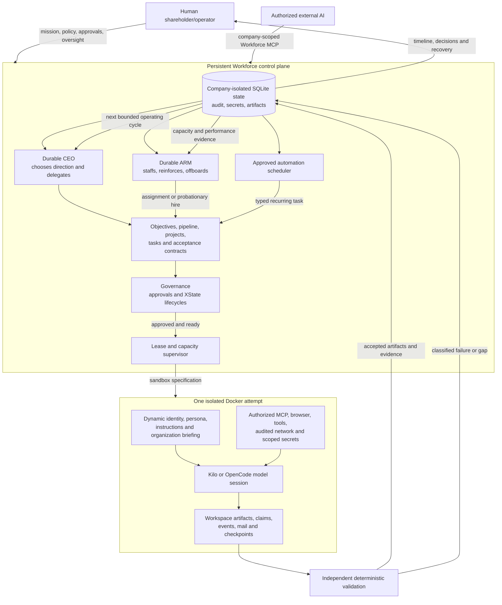

# Architecture

## Workforce logical flow

The graph reads from company intent at the top to verified outcomes and continuous adaptation at the
bottom. Solid arrows are ordinary work flow; governance decisions feed back into the same durable
company state rather than creating a parallel execution path.

In short: the CEO decides what the company should pursue, the ARM ensures the right workforce exists,
governance determines which consequential actions may proceed, and the supervisor turns only ready
tasks into isolated Docker attempts. Agents collaborate through scoped Workforce MCP and produce
untrusted output. Independent validators decide acceptance, persist evidence, and return the result to
the CEO and ARM for the next operating cycle.

## Trust boundary

The trusted control plane runs continuously as the `workforce-engine` Docker service. Its dedicated `workforce-state` named volume stores organization identities, tasks, chats, policies, sandbox specifications, normalized activities, raw-event references, approvals, encrypted secrets, artifacts, and audit events. The separate TUI client attaches to this service and never starts a second scheduler.

The trusted engine uses Docker-outside-of-Docker: its narrow Execa adapter talks to the host daemon through the mounted Docker socket and creates sibling attempt containers. It does not run a nested Docker daemon. This authority exists only in the control-plane service; agent containers never receive the socket or Docker control credentials.

Agent engines, model sessions, browser processes, package managers, build tools, shell commands, and job files live in per-attempt containers. Containers never receive the Docker socket. Inputs are copied into private Docker volumes; outputs are exported and validated after termination.

## Adaptive sandbox planner

The Agent Resources Manager must first turn a job into explicit requirements: risk, data sensitivity, capabilities, declared inputs, required outputs, network hosts, resources, engines, and acceptance criteria. The planner derives a sandbox profile and records every decision. It refuses contradictory capabilities rather than broadening permissions.

Profiles are starting points, not copied employee workspaces:

- Document: file output without shell or network.
- Research: public network through the audited internal Tinyproxy network when approved.
- Engineering: shell/build tools; approved registry, API, or web access uses audited egress.
- Browser: Playwright plus approved audited egress.
- Restricted review: no public network and no mutation beyond outputs.

Direct agent bridge networking is forbidden. Network-disabled attempts use Docker's `none` network. Network-capable attempts join only an internal agent network and reach external services through the separately managed, logged proxy container.

## Persistence boundaries

Repositories are company-scoped and domain-specific. Organization units and strategy items are separate typed aggregates; the superseded generic entity table was removed by migration 4. Application views read through repositories and services rather than issuing SQLite statements.

Every forward-only migration is a separately versioned SQL file in `src/storage/migrations` (`001.sql`, `002.sql`, and so on). The loader requires a contiguous sequence and records each successfully applied version in `schema_migrations`; production builds copy the same SQL files beside the compiled database adapter.

Encrypted credential metadata and ciphertext are part of the same migrated database schema. Migration `026.sql` owns the `secrets` table; initialization contains no hidden table creation. A legacy standalone secret database is transactionally imported once and retained with a `.migrated` suffix. The AES-GCM master key remains a mode-0600 file inside the persistent state volume and is never stored in SQLite.

## Conversations

The conversation application service composes separate room, thread, message, and attachment repositories. Rooms own membership, announcements, retention, and archival state. Threads and messages validate their company/room parents. Edits, redactions, pins, membership changes, and attachments are durable audit events; attachment records require SHA-256 digests and artifact URIs rather than embedding files in SQLite.

Agent mail crosses the sandbox boundary without exposing the control-plane database. A task granted `workforce-mail` receives a bounded immutable inbox snapshot. It may emit a `workforce-mail-outbox.json` artifact; only after archive validation and secret scanning does the control plane validate its schema, enforce the attempt employee as sender, re-check company-scoped recipients, and persist the messages with audit events.

Conversation rooms are managed records rather than implicit UI state. The Conversations area provides
selected-row editing, archival, and restoration for room configuration plus a creation chooser for
rooms, threads, messages, and immutable attachment references. Human authorship is inferred and
relationships are selected by readable labels. Memberships, messages, pins, redactions, and attachments
retain company and room isolation.

## No host fallback

Docker unavailability is a blocked execution state. The control plane, TUI, CEO, ARM, task management, and conversations remain available; no agent work begins.

## Durable supervisor

The Execa Docker adapter invokes only control-plane-authored Docker argument arrays and never a host shell. Attempts, leases, status events, and bounded output are durable. The scheduler starts two containers by default, reduces to one under memory pressure, and refills freed capacity from its FIFO queue. Startup reconciliation expires stale leases and removes labeled orphan containers. Timeouts, infrastructure failures, non-zero exits, and emergency stops are distinct terminal states. Docker unavailability moves queued work to an explicit infrastructure-blocked state and never selects a host execution path.

Every role runs the same direct-Alpine universal agent image. It contains both inference engines, Chromium, Node.js, pnpm, Git, Bash, Zsh, and audited retrieval utilities; npm is not installed. The rootless `workforce-toolchain` resolver can add any combination of Python, PHP/Composer/Laravel/Symfony, Go, Rust, Pandoc/office/PDF, ImageMagick, FFmpeg, and the pinned official Beads CLI beneath `/work/.tools`; requests are additive within the private writable volume and never modify the read-only root filesystem. Beads is provisioned with pnpm only when an active project integration grants `integration:beads`. The build removes non-target engine packages, pnpm's content-addressable store, package-manager caches, and temporary files, then verifies those paths are empty. The image includes Alpine's glibc compatibility layer for the official Beads binary. The verified universal image is 471,129,730 bytes, below the strict 500 MiB (524,288,000-byte) build limit.

MCP servers begin unverified and cannot be granted to tasks until a health receipt exists. The TUI health action launches a non-root, read-only, capability-dropped Docker probe that performs the MCP initialize handshake for local stdio or remote HTTP/SSE transports. Scoped credentials enter only through environment names, probe output is bounded, and the resulting receipt—not a form field—sets server health.

Kilo and OpenCode have separate command adapters. The supervisor rejects commands that were not produced in the selected adapter's non-interactive `run --model provider/model objective` shape. Image verification executes both pinned engines with networking disabled and validates their reported versions. Circuit-breaker policy selects a compatible fallback after repeated model failures and reopens a provider only after cooldown.

Model registry entries are company-scoped records. The TUI can configure and revise their engine, provider, model identifier, priority, capabilities, roles, and required secret names, but an identity change clears any prior health receipt. Verification retrieves narrowly scoped secrets, passes values only through the Docker client environment with name-only arguments, and invokes the actual engine/model inside the hardened universal image through audited egress. Bounded output is redacted before a receipt and audit event are stored. A task only selects a non-placeholder model whose health and independent verification permit execution; configuration alone never asserts that a provider is safe or reachable.

Immediately before each attempt, the control plane builds an organizational briefing from current company state. It includes mission, vision, values, configured shareholder/governance policy, the employee's durable identity and reporting line, organization units, active objectives/goals/milestones/projects, the assigned task contract and escalation path, business-pipeline counts, Workforce MCP collaboration instructions, and explicit boundaries. The briefing is combined with the versioned persona instructions inside the engine objective; its digest contributes to the persisted attempt instruction digest, so a changed company state produces traceably different attempt context without mutating instruction history.

## Workforce MCP boundary

The trusted control plane exposes an official-SDK MCP server through stdio for external clients and stateless Streamable HTTP on the internal agent network. A validated immutable principal fixes role, employee identity, allowed companies, and capabilities before connection. Tool discovery hides unavailable capabilities, while every application service repeats company and relationship authorization. Employee access is narrowed to assigned/reviewed tasks, joined rooms, own mail, and meetings where the employee participates. Agent mutations create normal domain audit events plus an MCP-origin audit event. Results are sanitized and bounded; attempt commands, environments, artifact host paths, and secret values are not returned.

Docker attempts declare encrypted persistent secrets and ephemeral control-plane credentials separately. Workforce generates a 15-minute HMAC-signed attempt token containing company, employee, task, attempt, role capabilities, timestamps, and a nonce. Docker receives the token only through its inherited process environment; the database and Docker argument vector contain its declared name but never its value. The HTTP service checks the signed identity against the currently active attempt, validates the Host header, bounds bodies and concurrency, rate limits each attempt, and denies expired, forged, cross-company, or ended credentials. Reissue invalidates the prior nonce and attempt completion revokes the active nonce.

The scoped MCP secret broker exposes metadata listing plus explicit fetch, set, and removal tools. Employee attempts are restricted to secret scopes matching both their employee and task claims; they cannot broaden newly created or updated records. CEO principals have complete secret authority inside their company only. Secret operations audit names, scopes, actors, and operation types without recording values.

Administrative MCP handlers call the same strategy, task, approval, employment, conversation, and registry services as the TUI. Idempotency records bind each principal, operation, key, and request digest, making exact retries safe while rejecting changed-request replay. Registry configuration cannot self-assert health. Runtime actions are injected separately from storage services: the MCP emergency action invokes a company-filtered supervisor stop, while the authenticated human control API owns the global stop.

## Acceptance

Container completion is only an attempt result. Independent control-plane validation checks required outputs, manifests, tests, policy violations, step exhaustion, permission failures, and acceptance criteria before a task can close.

## Automations

Agents may propose validated interval or strict cron automations, but proposals do not execute until approved. Approved actions are typed task templates rather than arbitrary commands. The scheduler calculates occurrences with `cron-parser`, creates ordinary audited company-scoped tasks, and dispatches them through the same Docker execution and acceptance path as human-created work. Each scheduled occurrence has a unique durable run record, preventing duplicate execution after repeated ticks or restarts; disable, archive, and restore preserve history.

## Business operations

Opportunity discovery, lead qualification, client relationships, and delivery engagements are durable company-scoped domains rather than labels embedded in generic task prose. Migration `028.sql` creates their relational pipeline with parent isolation. Separate typed repositories provide bounded search/pagination, validation, audited updates, and record-preserving archive/restore. Engagements require measurable success criteria and attach delivery work to a client; subsequent slices expose these services to autonomy, MCP, and the TUI.

The CEO operating loop uses a deterministic commercial planner over this durable state. It establishes one mission-aligned measurable objective, then selects the next bounded phase: discover opportunities, research an unresolved opportunity, qualify a lead, acquire a client, plan an engagement, or deliver and maintain an engagement. The chosen phase becomes an ordinary evidence-gated task executed through the Docker supervisor with Workforce MCP access. Existing ready work is reused across ticks and process restarts instead of duplicated. Missing mission, existing work, and pending governance produce explicit no-op/monitor decisions rather than busy loops.

External-contact phases require a human approval by default. A company may grant that specific class through `policies.autonomy.authorities`; broad CEO identity alone is not authority. A pending approval is linked to the exact CEO task, and a later operating cycle resumes or rejects that retained task from the recorded decision. Spending, publishing, account creation, credentials, destructive actions, contracts, and production mutation remain governed separately and are never implied by external-contact authority.

The ARM loop separately classifies terminal attempt failures as provider, infrastructure, permission, requirements, acceptance, or unknown. These classifications are durable deduplicated decisions and never become employee performance conclusions by themselves. Only explicit evidence-backed performance warnings or challenges can start reinforcement. Migration `029.sql` stores measurable reinforcement plans, review dates, evidence, outcomes, and ARM decisions. Recognition after a plan restores an eligible employee; repeated evidence after coaching fails the plan, issues a corrective warning through its XState lifecycle, and restricts future execution. Continued verified problems request governed termination unless the company explicitly grants `workforce-termination`. Approved offboarding waits for active attempts to stop, releases unfinished assignments, reassigns reports, and preserves the employee, performance, corrective, conversation, and audit history.

Company deletion is record-preserving archival. Migration `022.sql` persists the lifecycle status and the pre-archive autonomy setting. Archival is refused while attempts are active, stops CEO and ARM operating cycles, and disables approved automations; restoration preserves durable CEO/ARM identities and restores the prior autonomy choice instead of always starting the company. Archived companies remain visible in the multi-company TUI and must be restored before activation.

Task creation validates company-scoped project, parent-task, manager, assignee, and reviewer relationships. Requirements begin at version 1 and every objective, non-goal, acceptance, capability, network, or resource change creates an immutable version with actor and rationale. If an attempt is starting or running, a change is rejected unless it names an explicit safe checkpoint. Task dependencies are company-scoped and cannot self-reference.

## Workforce governance

Approval and employment transitions are XState machines; invalid or terminal transitions fail before persistence. The ARM records a capability, capacity, or temporary gap and evaluated alternatives before proposing a job-derived employee. Approved hires start on probation. Promotions, coaching, restrictions, reassignment, suspension, termination, reinstatement, and archival append immutable transition and audit records. Termination changes status and revokes eligibility without deleting the employee or their history. CEO and ARM identities are protected from this general transition workflow.

The Employees TUI uses the same governed employment service as automation. A human hire declares an objective, capability tokens, and measurable probation criteria; the ARM designer derives the sandbox, persona, system prompt, instructions, and durable identity before the human approval is recorded. Selected employees can have their versioned profile edited, or be terminated and reinstated through confirmed lifecycle actions. Offboarding is blocked by active attempts, releases unfinished assignments, and reassigns direct reports without deleting any records.

Meeting, incident, and corrective-action lifecycles are also XState machines. Meetings preserve agenda, participants, minutes, and owned action items. Incidents require evidence and severity before corrective actions can be drafted. Recognition, warnings, reviews, and challenges require evidence references. The claim ledger marks conflicting active values for the same subject and predicate as disputed and links both sides of the contradiction for human or shadow review.

Meetings are record-preserving managed resources: planned meetings may be edited; lifecycle archival cancels any planned or active meeting before archival; restoration returns an archived meeting to planned. The Meetings TUI uses selected-row create/edit/archive/restore actions with opaque confirmations and audit history.
